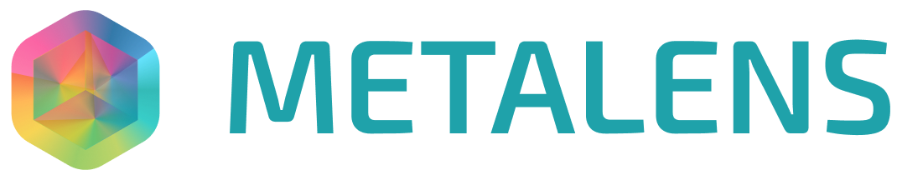

Stream-based visual programming language for systems observability.

**Metalens** allows to build observability programs in a reactive and visual way. On Linux, these programs are compiled into [eBPF](https://ebpf.io) and run in the kernel context, providing both efficiency and security.

**WARNING**: Currently, this repository contains only an experimental, throw-away proof-of-concept and the project is in the development stage.

## Running the server

### Docker

If you'd like to run the server using Docker, you need to build the image first.

For that, you need to switch the current directory to `docker` and run `build-image.sh`:

```bash
cd docker && ./build-images.sh
```

Then, from the root directory, run either `docker/run-server.sh` on Linux or `docker/run-macos.sh` on MacOS.

### Linux

To build the project, you need to install the latest version of the Rust compiler first. Please follow the instructions at https://rustup.rs/.

To run the server, you need to have the `CAP_BPF` capabilities. Or you can simply run the server using `sudo`:

```
sudo cargo run
```

## Running the front-end

```bash
cd frontend && \
  npm update && \
  npm start
```

The front-end should automatically connect to the WebSocket server that runs locally.

# License

The core components are available under the terms of the Apache 2.0 license or the MIT license at your choice. The front-end code is distributed under the terms of GNU Affero General Public License.
